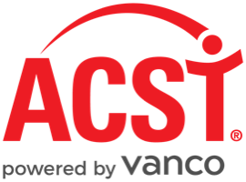
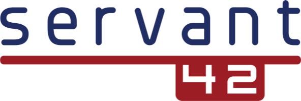
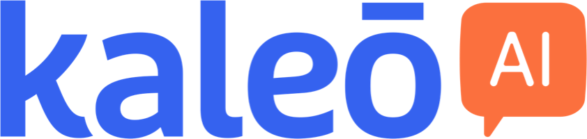
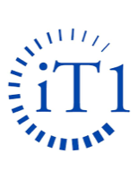

<div align="center">


# AI Context Engineering Workshop

### Peoria, IL — May 7-8, 2026

**A two-day hands-on workshop for church tech leaders who are ready to stop experimenting with AI and start building tools that actually work.**

[Event Details](https://churchitnetwork.com/regionals/peoria-il-2026)

</div>

---

## About This Event

This workshop focuses on **context engineering** — the discipline of designing the context that goes into every LLM interaction. Day 1 covers the foundations. Day 2 is a full build day where you apply what you've learned to real ministry challenges.

**Venue:** Northwoods Community Church — 10700 N. Allen Road, Peoria, IL 61615

| | Schedule |
|---|---|
| **May 6 (evening)** | Meet & Greet |
| **May 7, 9am–5pm** | Day 1 — Workshop (lunch & snacks provided) |
| **May 7, 6:30pm** | Dinner (included thanks to the generosity of our partners) |
| **May 8, 9am–5pm** | Day 2 — Workshop (lunch & snacks provided) |
| **May 8, 6:30pm** | Dinner (included thanks to the generosity of our partners) |

<p align="center"><strong>Made possible by our partners</strong></p>
<p align="center">
  
  &nbsp;&nbsp;&nbsp;&nbsp;
  
  &nbsp;&nbsp;&nbsp;&nbsp;
  
  &nbsp;&nbsp;&nbsp;&nbsp;
  
  &nbsp;&nbsp;&nbsp;&nbsp;
  
  &nbsp;&nbsp;&nbsp;&nbsp;
  
  &nbsp;&nbsp;&nbsp;&nbsp;
  
  &nbsp;&nbsp;&nbsp;&nbsp;
  
  &nbsp;&nbsp;&nbsp;&nbsp;
  
    &nbsp;&nbsp;&nbsp;&nbsp;
  
  &nbsp;&nbsp;&nbsp;&nbsp;
  
  &nbsp;&nbsp;&nbsp;&nbsp;
  
</p>

### 📱 CITN Conference App

> **All conference details and information live in the [CITN Conference app](https://app.churchitnetwork.com/app/).** All attendees will need it to **check in on Thursday morning (May 7)**, so download and sign in before you arrive.

### ⚠️ Before You Arrive

> **You must complete the [Prerequisites & Setup Guide](_requirements/README.md) before the workshop.**
>
> The setup takes 30–60 minutes and requires downloading several tools. **Do not wait until the morning of the event** — there won't be time to troubleshoot install issues on Day 1. If you run into problems, reach out ahead of time so we can help.

---

## Getting Started

```bash
git clone https://github.com/chriskehayias/ContextEngineering.git
cd ContextEngineering
```

## Resources

A collection of cheat sheets, tools, and reference materials is available in the [Resources](resources/README.md) folder to support you before, during, and after the workshop.

## License

TBD

---

<div align="center">

</div>
