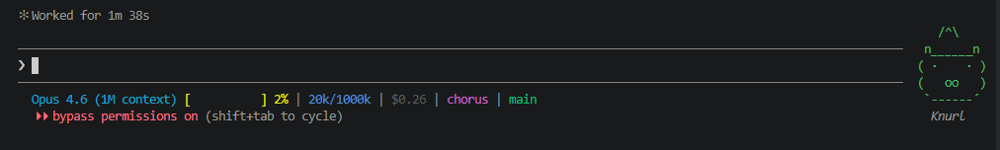

#  Custom Status Line for Claude Code

A custom status line that replaces Claude Code's default with a rich, color-coded display showing model info, context usage, cost tracking, project name, and git branch — all at a glance.



## What It Shows

| Section | Color | Description |
|---------|-------|-------------|
| **Model** | Cyan | Shortened model name (e.g., "Opus 4.6" instead of "Claude Opus 4.6") |
| **Context Bar** | Yellow / Red | A visual `[====      ]` progress bar with percentage. Turns red when usage exceeds 80% or 200k tokens |
| **Token Count** | Blue | Used vs. total tokens in `k` format (e.g., `45k/200k`) |
| **Cost** | Dim | Running session cost in USD (e.g., `$0.42`) — only shown when > $0 |
| **Project** | Magenta | Current working directory name |
| **Git Branch** | Green | Active git branch |

Sections are separated by ` | ` for easy scanning.

---

## Installation

### Step 1: Copy the Script

Copy `statusline.js` to your Claude config directory:

**Windows:**
```bash
cp statusline.js ~/.claude/statusline.js
```

**macOS / Linux:**
```bash
cp statusline.js ~/.claude/statusline.js
chmod +x ~/.claude/statusline.js
```

### Step 2: Update Claude Code Settings

Open (or create) your `~/.claude/settings.json` and add the `statusLine` entry:

```json
{
  "statusLine": {
    "type": "command",
    "command": "node ~/.claude/statusline.js"
  }
}
```

> **Note:** If you already have a `settings.json`, just merge the `statusLine` key into your existing config. Don't overwrite the whole file.

### Step 3: Restart Claude Code

Close and reopen Claude Code. Your new status line should appear immediately.

---

## How It Works

The script receives a JSON payload from Claude Code via `stdin` containing session data (model info, context window stats, workspace details, cost). It parses that data and outputs a single formatted line with ANSI color codes.

Key behaviors:
- **Context warning:** The progress bar turns red when context usage exceeds 80% or the `exceeds_200k_tokens` flag is set, plus a `!!` warning tag appears
- **Git-aware:** Automatically detects the current git branch in your workspace
- **Cross-platform:** Works on both Windows (`\` paths) and Unix (`/` paths)
- **Graceful fallback:** If git isn't available or you're not in a repo, that section is simply omitted

---

## Files

| File | Description |
|------|-------------|
| `statusline.js` | The status line script — copy this to `~/.claude/` |
| `settings-example.json` | Example settings snippet showing the required config |
