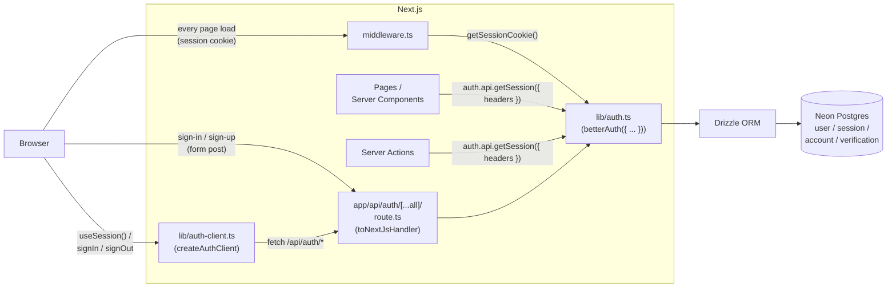

# Better Auth — standalone, with Google SSO, with Microsoft SSO

[Better Auth](https://better-auth.com) is a TypeScript-first, framework-agnostic authentication library that **runs on your server and writes to your database**. No third-party SaaS, no per-MAU billing. You own the `users` / `sessions` / `accounts` / `verifications` tables, you join them to your domain tables in the same database, you control the security surface.

This is the default auth choice for the [web starter](../web-nextjs.md). This doc has three sections:

1. **[Standalone](#1-standalone-emailpassword)** — email/password, sessions, basic protection. The minimum viable auth.
2. **[+ Google SSO](#2--google-sso)** — add "Sign in with Google" alongside (or instead of) password.
3. **[+ Microsoft SSO](#3--microsoft-sso)** — add "Sign in with Microsoft" (Entra ID / Azure AD).

You can ship any combination. They share the same `users` table — a user who signs up with email today and links Google tomorrow is the same user.

---

## When to pick Better Auth (and when not to)

| Pick Better Auth when… | Pick a hosted provider (Auth0 / Clerk / WorkOS) when… |
|---|---|
| You have one app and want auth tightly integrated with your data | You have **multiple apps** that need one identity across all of them |
| You want to join `users` to your domain tables in a single transaction | You don't want to own the security surface |
| You want zero per-MAU cost; you'll pay your DB bill anyway | You want enterprise SSO/SAML, SCIM provisioning, audit logs out of the box |
| Your team is comfortable running migrations and rotating secrets | You want a dashboard your non-eng team can use to manage users |

Better Auth is **not** the right answer for a B2B SaaS that needs SAML against random customer IdPs. For that, use WorkOS or Auth0. It **is** the right answer for almost everything else this workshop's audience builds — internal tools, member portals, dashboards, AI-augmented apps.

---

## 1. Standalone (email/password)

The simplest possible Better Auth config: email + password, sessions in cookies, Drizzle adapter writing to Neon Postgres.

### Stack at a glance

| Slot | Default | Notes |
|---|---|---|
| Library | `better-auth` | Server SDK |
| Adapter | `drizzleAdapter` from `better-auth/adapters/drizzle` | Talks to your existing Drizzle `db` |
| HTTP surface | `app/api/auth/[...all]/route.ts` | One catch-all handles every auth route |
| Session storage | Database (default) — rows in the `session` table; HTTP-only cookie carries the token | Switch to Redis-backed sessions later if you need it |
| Schema | `user`, `session`, `account`, `verification` — generated by `npx @better-auth/cli generate` | Lives in `db/schema.ts` alongside app tables |

### Architecture diagram



**One sentence:** every auth route — sign-up, sign-in, sign-out, session check, OAuth callback — flows through `app/api/auth/[...all]/route.ts`, which delegates to the single `auth` instance configured in `lib/auth.ts`, which writes to Neon via Drizzle.

### Implementation context (drop into PRD or CLAUDE.md)

````markdown
**Auth library:** Better Auth (self-hosted, owns `user` / `session` / `account` / `verification` tables in Neon via Drizzle).

**File layout:**
- `lib/auth.ts` — `betterAuth({...})` server instance (the single source of truth for auth config)
- `lib/auth-client.ts` — `createAuthClient(...)` for client components (`useSession`, `signIn`, `signOut`)
- `app/api/auth/[...all]/route.ts` — `toNextJsHandler(auth)` mounts every auth route
- `middleware.ts` — protects routes via `getSessionCookie(request)` from `better-auth/cookies`
- `db/schema.ts` — Better Auth tables sit here, generated by `npx @better-auth/cli generate`

**Env vars (`.env.local`):**
```
DATABASE_URL=postgres://...               # from Neon dashboard
BETTER_AUTH_SECRET=...                    # openssl rand -base64 32
BETTER_AUTH_URL=http://localhost:3000     # set to deployed URL in production
```

**Server config (`lib/auth.ts`):**
```ts
import { betterAuth } from "better-auth";
import { drizzleAdapter } from "better-auth/adapters/drizzle";
import { db } from "@/db";

export const auth = betterAuth({
  database: drizzleAdapter(db, { provider: "pg" }),
  emailAndPassword: {
    enabled: true,
    autoSignIn: true,        // sign the user in immediately after sign-up
    requireEmailVerification: false, // flip on in production once Resend is wired up
  },
  trustedOrigins: [process.env.BETTER_AUTH_URL!],
});
```

**Client (`lib/auth-client.ts`):**
```ts
import { createAuthClient } from "better-auth/react";

export const authClient = createAuthClient({
  // baseURL is inferred from the current origin in the browser; only set this
  // if your auth handler lives on a different origin
});

export const { signIn, signOut, signUp, useSession } = authClient;
```

**HTTP handler (`app/api/auth/[...all]/route.ts`):**
```ts
import { auth } from "@/lib/auth";
import { toNextJsHandler } from "better-auth/next-js";

export const { GET, POST } = toNextJsHandler(auth);
```

**Reading the session in a Server Component:**
```ts
import { auth } from "@/lib/auth";
import { headers } from "next/headers";
import { redirect } from "next/navigation";

export default async function DashboardPage() {
  const session = await auth.api.getSession({ headers: await headers() });
  if (!session) redirect("/sign-in");
  return <h1>Welcome {session.user.name}</h1>;
}
```

**Reading the session in a Server Action:**
```ts
"use server";
import { auth } from "@/lib/auth";
import { headers } from "next/headers";

export async function createPost(formData: FormData) {
  const session = await auth.api.getSession({ headers: await headers() });
  if (!session) throw new Error("Unauthorized");
  // session.user.id is now safe to use as the author
}
```

**Middleware (`middleware.ts`) — fast cookie-only check, no DB hit per request:**
```ts
import { NextRequest, NextResponse } from "next/server";
import { getSessionCookie } from "better-auth/cookies";

export function middleware(request: NextRequest) {
  const sessionCookie = getSessionCookie(request);
  const { pathname } = request.nextUrl;

  if (!sessionCookie && pathname.startsWith("/dashboard")) {
    return NextResponse.redirect(new URL("/sign-in", request.url));
  }
  if (sessionCookie && ["/sign-in", "/sign-up"].includes(pathname)) {
    return NextResponse.redirect(new URL("/dashboard", request.url));
  }
  return NextResponse.next();
}

export const config = {
  matcher: ["/dashboard/:path*", "/sign-in", "/sign-up"],
};
```

> Middleware reads the cookie's existence, not its validity. Server Components and Server Actions still call `auth.api.getSession()` to verify against the DB. This split keeps page navigation fast while keeping the trust boundary at the data-access layer.

**Migrations after schema changes:**
```bash
npx @better-auth/cli generate   # regenerates Better Auth tables in db/schema.ts
npx drizzle-kit generate        # produces a SQL migration
npx drizzle-kit migrate         # applies it to Neon
```
````

---

## 2. + Google SSO

Adding Google as a social provider on top of the standalone setup is **two lines of config + one Google Cloud Console screen**. The same `user` row gets a linked `account` row tying their Google identity to it.

For the *full* Google Cloud Console walkthrough, scope choices, and Workspace vs personal account behavior, see [google-sso.md](google-sso.md). This section is the Better Auth-side glue.

### What changes vs standalone

- Add `socialProviders.google` to `lib/auth.ts`.
- Add `GOOGLE_CLIENT_ID` and `GOOGLE_CLIENT_SECRET` to `.env.local`.
- Register an authorized redirect URI in Google Cloud Console: `{BETTER_AUTH_URL}/api/auth/callback/google`.
- Add a "Sign in with Google" button that calls `authClient.signIn.social({ provider: "google" })`.

### Implementation context (drop into PRD or CLAUDE.md)

````markdown
**Google SSO via Better Auth.**

**Provider setup (Google Cloud Console):**
1. Create (or reuse) a project at [console.cloud.google.com](https://console.cloud.google.com).
2. **APIs & Services → OAuth consent screen** — set app name, support email, developer email. Add the scopes `userinfo.email`, `userinfo.profile`, `openid`. Mark as **External** unless you only allow one Workspace.
3. **APIs & Services → Credentials → Create credentials → OAuth client ID** — type "Web application".
4. **Authorized redirect URIs** — add:
   - `http://localhost:3000/api/auth/callback/google` (dev)
   - `https://{your-domain}/api/auth/callback/google` (production)
5. Copy the Client ID and Client Secret into `.env.local`.

**Env vars (added):**
```
GOOGLE_CLIENT_ID=...
GOOGLE_CLIENT_SECRET=...
```

**Server config (`lib/auth.ts`) — additions only:**
```ts
export const auth = betterAuth({
  // ...existing config
  socialProviders: {
    google: {
      clientId: process.env.GOOGLE_CLIENT_ID!,
      clientSecret: process.env.GOOGLE_CLIENT_SECRET!,
      // Optional: scopes beyond the default (email, profile, openid)
      // scopes: ["https://www.googleapis.com/auth/calendar.readonly"],
      // Optional: force account chooser even when user has one Google account
      // prompt: "select_account",
    },
  },
});
```

**Client — sign-in button (Client Component):**
```tsx
"use client";
import { authClient } from "@/lib/auth-client";
import { Button } from "@/components/ui/button";

export function SignInWithGoogle() {
  return (
    <Button
      onClick={() =>
        authClient.signIn.social({
          provider: "google",
          callbackURL: "/dashboard",
          errorCallbackURL: "/sign-in?error=google",
        })
      }
    >
      Sign in with Google
    </Button>
  );
}
```

**Requesting additional Google scopes after sign-up** (e.g., later prompt for Drive access):
```ts
await authClient.linkSocial({
  provider: "google",
  scopes: ["https://www.googleapis.com/auth/drive.file"],
});
```
The user already has a session — `linkSocial` re-runs the OAuth dance to attach the new scopes to their existing `account` row. (Requires Better Auth 1.2.7+ to handle the "already linked" case correctly.)

**Account linking semantics:**
- A user who signs up with email and *later* signs in with a Google account that has the same email gets the Google identity linked to their existing user row (Better Auth's default `accountLinking` behavior). Configure stricter linking via `account: { accountLinking: { ... } }` if you don't want this.
- The provider's `id_token` and access/refresh tokens are stored on the `account` row, not the `user` row.
````

---

## 3. + Microsoft SSO

Microsoft sign-in is the same shape as Google, with two extra knobs: **tenant** (which Entra directories can sign in) and **prompt** (whether to force the account picker).

For the full Entra ID walkthrough — single-tenant vs multi-tenant decisions, Graph API scopes, common gotchas — see [microsoft-sso.md](microsoft-sso.md). This section is the Better Auth glue.

### What changes vs standalone

- Add `socialProviders.microsoft` to `lib/auth.ts` with `tenantId` set appropriately.
- Add `MICROSOFT_CLIENT_ID` and `MICROSOFT_CLIENT_SECRET` to `.env.local`.
- Register the redirect URI on the Entra app registration: `{BETTER_AUTH_URL}/api/auth/callback/microsoft`.
- Add a "Sign in with Microsoft" button that calls `authClient.signIn.social({ provider: "microsoft" })`.

### Implementation context (drop into PRD or CLAUDE.md)

````markdown
**Microsoft SSO via Better Auth.**

**Provider setup (Microsoft Entra admin center → App registrations):**
1. Go to [entra.microsoft.com](https://entra.microsoft.com) → **Applications → App registrations → New registration**.
2. **Name** the app (visible to consenting users), choose **Supported account types** (see tenant section below).
3. **Redirect URI** — type "Web", value `{BETTER_AUTH_URL}/api/auth/callback/microsoft`. Add both dev and prod URIs.
4. Copy the **Application (client) ID** → this is `MICROSOFT_CLIENT_ID`.
5. **Certificates & secrets → New client secret** → copy the **Value** (not the ID) → this is `MICROSOFT_CLIENT_SECRET`. Secret is only shown once.
6. **API permissions** — `User.Read` (delegated, Microsoft Graph) is added by default and is enough for sign-in. Add more only if you need them.

**Tenant decision (which directories can sign in):**
| `tenantId` value | Who can sign in |
|---|---|
| `"common"` | Any Microsoft account — work, school, or personal (Outlook.com, Hotmail) |
| `"organizations"` | Any work/school account (any Entra tenant) — no personal accounts |
| `"consumers"` | Personal accounts only |
| Specific GUID | Only users in that one tenant (single-tenant — most common for internal tools) |

**Env vars (added):**
```
MICROSOFT_CLIENT_ID=...
MICROSOFT_CLIENT_SECRET=...
MICROSOFT_TENANT_ID=common   # or your tenant GUID
```

**Server config (`lib/auth.ts`) — additions only:**
```ts
export const auth = betterAuth({
  // ...existing config
  socialProviders: {
    // ...google, if also configured
    microsoft: {
      clientId: process.env.MICROSOFT_CLIENT_ID!,
      clientSecret: process.env.MICROSOFT_CLIENT_SECRET!,
      tenantId: process.env.MICROSOFT_TENANT_ID ?? "common",
      // Defaults are usually fine; override if you need to:
      // authority: "https://login.microsoftonline.com",
      // prompt: "select_account",  // forces the account picker every time
    },
  },
});
```

**Client — sign-in button:**
```tsx
"use client";
import { authClient } from "@/lib/auth-client";
import { Button } from "@/components/ui/button";

export function SignInWithMicrosoft() {
  return (
    <Button
      variant="outline"
      onClick={() =>
        authClient.signIn.social({
          provider: "microsoft",
          callbackURL: "/dashboard",
          errorCallbackURL: "/sign-in?error=microsoft",
        })
      }
    >
      Sign in with Microsoft
    </Button>
  );
}
```

**Requesting Microsoft Graph scopes** (e.g., read calendar later):
```ts
await authClient.linkSocial({
  provider: "microsoft",
  scopes: ["Calendars.Read"],
});
```

**Account linking note:** if your `tenantId` is a specific GUID (single-tenant), users outside that tenant get a Microsoft-side error before Better Auth ever sees the request — that's the desired behavior for "internal tool". If you set `"common"` and want to *additionally* gate by tenant after sign-in (e.g., only allow `@yourcompany.com`), do it in a `databaseHooks.user.create.before` hook on `lib/auth.ts` or in the post-sign-in handler.
````

---

## All three together

When you ship email/password + Google + Microsoft together, your `lib/auth.ts` looks like this:

```ts
import { betterAuth } from "better-auth";
import { drizzleAdapter } from "better-auth/adapters/drizzle";
import { db } from "@/db";

export const auth = betterAuth({
  database: drizzleAdapter(db, { provider: "pg" }),
  emailAndPassword: { enabled: true, autoSignIn: true },
  socialProviders: {
    google: {
      clientId: process.env.GOOGLE_CLIENT_ID!,
      clientSecret: process.env.GOOGLE_CLIENT_SECRET!,
    },
    microsoft: {
      clientId: process.env.MICROSOFT_CLIENT_ID!,
      clientSecret: process.env.MICROSOFT_CLIENT_SECRET!,
      tenantId: process.env.MICROSOFT_TENANT_ID ?? "common",
    },
  },
  trustedOrigins: [process.env.BETTER_AUTH_URL!],
});
```

A user can sign up with any of the three methods, and any combination can be linked to one user record. The `account` table tracks which providers each user has connected.

---

## Use Context7 for current docs

Before writing non-trivial Better Auth code, fetch the latest docs via the Context7 MCP server. Better Auth is moving fast — config keys, plugin APIs, and the CLI generator have all shifted across minor versions.

Libraries to consult via Context7 when relevant:
- `better-auth` — server config (`betterAuth({...})`), Drizzle adapter, `toNextJsHandler`, `auth.api.getSession`, `getSessionCookie`, social providers, `accountLinking`, `databaseHooks`
- `better-auth/react` — `createAuthClient`, `useSession`, `signIn.social`, `linkSocial`
- `drizzle-orm` — schema changes for the Better Auth tables, migration generation
- `next.js` — App Router middleware, Server Component data fetching, `revalidatePath` after auth state changes

When unsure, prefer a Context7 lookup over guessing.

---

## Related

- [google-sso.md](google-sso.md) — full Google Cloud Console walkthrough and OAuth concepts
- [microsoft-sso.md](microsoft-sso.md) — full Entra ID app registration and tenant model
- [rbac.md](rbac.md) — once auth is in, decide who can do what
- [../web-nextjs.md](../web-nextjs.md) — the parent Next.js starter
