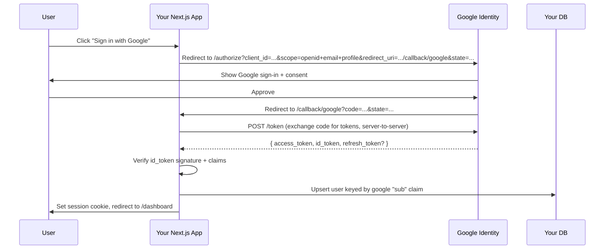

# Google SSO — implementation guide

"Sign in with Google" for a Next.js app. This doc covers the **Google side** (Cloud Console, OAuth concepts, scopes, Workspace vs personal accounts) and three **integration paths** (Better Auth — recommended, Auth.js, hand-rolled OAuth).

If you've already picked Better Auth, skim section 1 (Cloud Console setup) and then jump to [better-auth.md § Google SSO](better-auth.md#2--google-sso) for the glue code. The rest of this doc is for understanding *why* the setup looks the way it does, and for the cases where Better Auth isn't a fit.

---

## What "Sign in with Google" actually is

Google SSO is **OAuth 2.0 + OpenID Connect (OIDC)**. The flow:



Three things to internalize:

1. **OIDC piggybacks on OAuth 2.0.** OAuth gives you an access token (permission to call Google APIs); OIDC adds an `id_token` (a signed JWT proving who the user is). For pure sign-in you only need the `id_token`; access tokens come into play when you also want to call Google APIs (Drive, Calendar, Gmail).
2. **The `sub` (subject) claim is the user's stable Google ID.** Don't key your user record on email — emails change. Key on `sub` and store email as a profile field.
3. **The OAuth client lives on your server.** The client secret never touches the browser. The browser only sees the front-channel redirects (authorize, callback). Token exchange is server-to-server.

This is the same flow regardless of which library you use — the libraries just hide the redirects, signature checks, and token storage.

---

## 1. Google Cloud Console setup (do this first, regardless of library)

### Step 1: Create / pick a Google Cloud project

1. Go to [console.cloud.google.com](https://console.cloud.google.com).
2. Top-left project picker → **New Project** (or reuse an existing one). One project can host OAuth clients for multiple apps; most people make one project per app to keep secrets and permissions scoped.

### Step 2: Configure the OAuth consent screen

This is what users see when they click "Sign in with Google" the first time. Path: **APIs & Services → OAuth consent screen**.

| Field | What to set | Notes |
|---|---|---|
| **User type** | `External` (anyone with a Google account) or `Internal` (only your Workspace) | `Internal` is only available if your project lives under a Workspace org. Internal apps skip Google's verification process. |
| **App name** | The name on the consent screen | Users see this — make it the product name |
| **User support email** | An email you own | Required |
| **Developer contact email** | Same | Required |
| **App logo** | Optional, 120×120 PNG | Adds polish; required for verification |
| **Authorized domains** | Your production domain (e.g. `mychurch.org`) | No paths or schemes |
| **Scopes** | `openid`, `userinfo.email`, `userinfo.profile` (and any extras you need — see below) | Adding sensitive scopes triggers Google's verification process |
| **Test users** | Add yourself + teammates while in `Testing` status | Until you publish, only listed test users can sign in |

**Publishing status:** the consent screen starts in `Testing`. While in testing, the access token expires after **7 days** and only test users can sign in. Click **Publish App** when you're ready for real users. If you only request the basic scopes (email/profile/openid), publishing is instant and verification isn't required.

### Step 3: Create the OAuth 2.0 Client ID

Path: **APIs & Services → Credentials → Create credentials → OAuth client ID**.

| Field | Value |
|---|---|
| **Application type** | `Web application` |
| **Name** | "Next.js Web App — local + prod" (just for your own bookkeeping) |
| **Authorized JavaScript origins** | `http://localhost:3000` and `https://{your-domain}` |
| **Authorized redirect URIs** | `http://localhost:3000/api/auth/callback/google` and `https://{your-domain}/api/auth/callback/google` |

The redirect URI **must match byte-for-byte** what your auth library posts. Better Auth uses `/api/auth/callback/google`; Auth.js uses `/api/auth/callback/google`; if you hand-roll, you pick. Mismatches produce `redirect_uri_mismatch` errors.

After creating, you get a **Client ID** and **Client Secret**. The secret is only shown when you press the copy/download button — store it in `.env.local` immediately. You can rotate it later if you lose it.

### Step 4: Decide which scopes you actually need

| Scope | Why | Triggers verification? |
|---|---|---|
| `openid` | OIDC marker — required to receive an `id_token` | No |
| `https://www.googleapis.com/auth/userinfo.email` | User's email | No |
| `https://www.googleapis.com/auth/userinfo.profile` | Name and avatar | No |
| `https://www.googleapis.com/auth/drive.file` | Per-file Drive access (only files your app creates/opens) | No (non-sensitive) |
| `https://www.googleapis.com/auth/drive` | Full Drive access | **Yes — sensitive scope, Google verification** |
| `https://www.googleapis.com/auth/calendar.readonly` | Read user's calendars | **Yes — sensitive** |
| `https://www.googleapis.com/auth/gmail.send` | Send email as the user | **Yes — restricted scope, third-party assessment** |

**Default for sign-in only:** `openid`, `email`, `profile`. Add more scopes only when you actually need them, and prefer non-sensitive scopes when there's a choice (e.g., `drive.file` over `drive`). Restricted scopes (Gmail full access, full Drive) require an annual third-party security assessment — budget time for it.

> **Incremental authorization:** request the bare minimum at sign-in, then prompt for additional scopes later when the user actually invokes the feature that needs them. Better Auth's `authClient.linkSocial({ provider: "google", scopes: [...] })` does exactly this.

---

## 2. Workspace vs personal Google accounts

| Account type | Sign-in works? | Considerations |
|---|---|---|
| Personal `@gmail.com` | Yes (if `External` consent screen + published, or test user) | No admin controls — any Gmail user can sign in unless you filter by `hd` claim |
| Google Workspace (e.g. `@yourchurch.org`) | Yes | The `id_token` includes a `hd` (hosted domain) claim. Use it to gate access. |
| Workspace + admin restricts third-party apps | Maybe — admins can block your OAuth client | If you're building for a specific Workspace, ask their admin to allow-list your client ID |

**Restricting sign-in to a specific Workspace domain:** check the `hd` claim on the verified `id_token` and reject anything else. With Better Auth, do this in a `databaseHooks.user.create.before` hook:

```ts
// lib/auth.ts (excerpt)
export const auth = betterAuth({
  // ...
  socialProviders: {
    google: { clientId: ..., clientSecret: ... },
  },
  databaseHooks: {
    user: {
      create: {
        before: async (user, ctx) => {
          // Only enforce for Google sign-ins
          const accountInfo = ctx?.context?.newSession?.user;
          if (!user.email?.endsWith("@yourchurch.org")) {
            throw new Error("Only @yourchurch.org accounts may sign in");
          }
          return { data: user };
        },
      },
    },
  },
});
```

For the same effect at the *Google* layer (so users from outside your Workspace never see your consent screen at all), set the consent screen's `User type` to **Internal** if you have a Workspace org.

---

## 3. Integration path A — Better Auth (recommended)

This is the default for the [web starter](../web-nextjs.md). Full implementation context lives in [better-auth.md § Google SSO](better-auth.md#2--google-sso). Summary:

- One config block in `lib/auth.ts` (`socialProviders.google`)
- One callback URL: `/api/auth/callback/google`
- One client call: `authClient.signIn.social({ provider: "google" })`
- Better Auth handles state/PKCE, `id_token` verification, account linking, refresh-token storage automatically.

**When this is the right answer:** you're already on (or open to) Better Auth, and you want auth that owns the database next to your domain tables.

---

## 4. Integration path B — Auth.js (NextAuth v5)

Pick this if you're already on Auth.js (the project formerly known as NextAuth) or you want auth that's dead simple to drop in without a database layer to start. Auth.js can run JWT-only sessions with no DB.

**Install:**
```bash
npm install next-auth@beta
```

**Server config (`auth.ts` at project root):**
```ts
import NextAuth from "next-auth";
import Google from "next-auth/providers/google";

export const { handlers, signIn, signOut, auth } = NextAuth({
  providers: [
    Google({
      clientId: process.env.AUTH_GOOGLE_ID,
      clientSecret: process.env.AUTH_GOOGLE_SECRET,
    }),
  ],
});
```

**HTTP handler (`app/api/auth/[...nextauth]/route.ts`):**
```ts
export { GET, POST } from "@/auth";
```

**Env vars:**
```
AUTH_SECRET=...
AUTH_GOOGLE_ID=...
AUTH_GOOGLE_SECRET=...
```

**Redirect URI in Google Cloud Console:** `{base}/api/auth/callback/google` — same as Better Auth.

**Sign-in:**
```tsx
import { signIn } from "@/auth";
<form action={async () => { "use server"; await signIn("google"); }}>
  <button type="submit">Sign in with Google</button>
</form>
```

**Reading session:**
```ts
import { auth } from "@/auth";
const session = await auth();
```

**Trade-offs vs Better Auth:**
- ✅ Smaller initial setup (JWT sessions need no DB)
- ✅ Massive ecosystem of providers
- ❌ Database adapter is more opinionated; integrating with Drizzle is more boilerplate than Better Auth's adapter
- ❌ RBAC and admin-style features require third-party plugins or hand-rolled callbacks

---

## 5. Integration path C — hand-rolled OAuth

Don't, unless you have a specific reason — auth is one of the highest-stakes places to write your own. The reasons it's *sometimes* right:

- You're integrating with a non-OIDC system that requires custom token handling
- You're building an authentication library yourself
- You're learning, and "doing it the hard way" is the point

If you do, the building blocks:
- The [`google-auth-library`](https://www.npmjs.com/package/google-auth-library) Node package handles `id_token` verification correctly (signature check against Google's published JWKs, claim validation).
- Generate `state` and `code_verifier` (PKCE) per request, store in a short-lived cookie, verify on callback.
- Verify the `id_token` against `https://www.googleapis.com/oauth2/v3/certs` and check `iss`, `aud`, `exp`, `nonce`.
- Store `sub` as your foreign key to Google. Never use email.
- Encrypt your session cookie or back it with a server-side store. Set `HttpOnly`, `Secure`, `SameSite=Lax`.

Skip this section unless you've read it as a warning.

---

## Production checklist

Before shipping Google sign-in to real users:

- [ ] Consent screen is **Published** (not Testing) unless internal-only via Workspace
- [ ] Production redirect URI is in the OAuth client config (must be HTTPS)
- [ ] `BETTER_AUTH_URL` (or `AUTH_URL`) matches the production origin exactly
- [ ] Client secret is set in your hosting platform's env vars (Vercel → Settings → Environment Variables), not just `.env.local`
- [ ] If you request sensitive/restricted scopes, you've completed Google's verification process
- [ ] You have a sign-out flow (`authClient.signOut()`) and you've tested it end-to-end
- [ ] You've decided what happens when a Google account's email changes (Google notifies via the `email_verified` claim and a separate webhook system; for most apps, just keep `sub` as the key and let email update naturally)
- [ ] Error states have a user-visible page, not a stack trace — Better Auth's `errorCallbackURL` and Auth.js's error pages both surface this

---

## Use Context7 for current docs

Before writing non-trivial OAuth/Google integration code, fetch the latest via Context7. Google API console UIs and library APIs both shift.

Libraries to consult via Context7 when relevant:
- `better-auth` — `socialProviders.google`, `linkSocial`, `accountLinking`
- `next-auth` — Google provider config, JWT vs database sessions, `auth()` helper
- `googleapis` / `google-auth-library` — if you're calling Google APIs after sign-in (Drive, Calendar, etc.)

---

## Related

- [better-auth.md](better-auth.md) — recommended integration; full code blocks
- [microsoft-sso.md](microsoft-sso.md) — sibling provider; same shape, different tenant model
- [rbac.md](rbac.md) — what to do once Google sign-in is working
