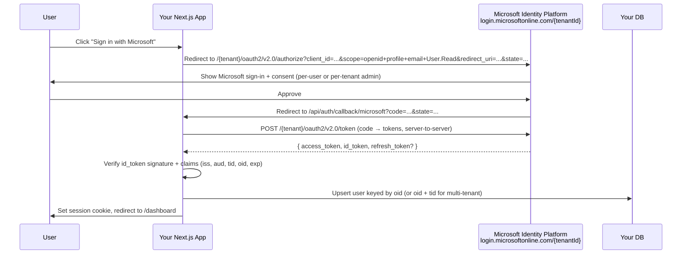

# Microsoft SSO — implementation guide

"Sign in with Microsoft" for a Next.js app. This doc covers the **Microsoft side** (Entra ID app registration, single-tenant vs multi-tenant, Graph scopes, common gotchas) and three **integration paths** (Better Auth — recommended, Auth.js, MSAL).

If you've already picked Better Auth, skim section 1 (Entra ID setup) and then jump to [better-auth.md § Microsoft SSO](better-auth.md#3--microsoft-sso) for the glue code. The rest of this doc is for understanding *why* the setup looks the way it does.

> **Naming:** "Azure AD" and "Microsoft Entra ID" are the same product — Microsoft renamed it in 2023. Throughout this doc we use "Entra ID" since that's the current label across Azure portal, docs, and admin URLs. Library config still calls it `microsoft` (Better Auth) or `azure-ad` / `microsoft-entra-id` (Auth.js).

---

## What "Sign in with Microsoft" actually is

Microsoft sign-in is **OAuth 2.0 + OpenID Connect** against the Microsoft Identity Platform. The flow is identical to Google's (authorize → consent → callback → exchange code for tokens → verify `id_token` → upsert user), with three Microsoft-specific knobs:

1. **Tenant** — which Entra directories are allowed to sign in (one specific org, any org, any account including personal Outlook).
2. **`v2.0` endpoint** — there's a legacy `v1.0` endpoint you should never touch. All modern libraries use `v2.0` automatically.
3. **`oid` claim is the stable user ID per tenant; `sub` is per-app.** Don't key your users on email — emails change, especially in Active Directory environments.



---

## 1. Entra ID app registration (do this first, regardless of library)

### Step 1: Sign in to the Entra admin center

Go to [entra.microsoft.com](https://entra.microsoft.com). You need an account with permission to create app registrations in the directory — typically an Application Administrator, Cloud Application Administrator, or Global Administrator role. If you don't have it, find someone in IT who does.

### Step 2: New app registration

Path: **Applications → App registrations → New registration**.

| Field | What to set | Notes |
|---|---|---|
| **Name** | The name shown on the consent screen | Users see this — make it the product name |
| **Supported account types** | One of four options — see decision table below | Single biggest decision; affects which `tenantId` you use later |
| **Redirect URI** | Platform `Web` + `https://{your-domain}/api/auth/callback/microsoft` | Add `http://localhost:3000/api/auth/callback/microsoft` later for dev |

**Supported account types decision:**

| Choice | `tenantId` value | Who can sign in | When to pick this |
|---|---|---|---|
| Accounts in this organizational directory only (Single tenant) | the GUID of your tenant | Only users in your tenant | Internal staff tools — most common for "auth for our team" |
| Accounts in any organizational directory (Multitenant) | `organizations` | Any work/school account from any Entra tenant | B2B SaaS — users from any company can sign in |
| Multitenant + personal Microsoft accounts | `common` | Any work/school account *or* personal (Outlook.com, Hotmail, Live) | Consumer-facing app |
| Personal Microsoft accounts only | `consumers` | Personal accounts only | Rare; most apps want at least work accounts |

> **You can change this later**, but each change forces a re-consent. Pick deliberately the first time. For the workshop's typical "internal church staff tool" use case, **Single tenant** is the right pick.

### Step 3: Grab the Client ID

After registration, the **Overview** page shows:
- **Application (client) ID** — copy this → `MICROSOFT_CLIENT_ID`
- **Directory (tenant) ID** — copy this if you picked single-tenant → `MICROSOFT_TENANT_ID`. If you picked multi-tenant, use the literal string `common`, `organizations`, or `consumers` instead.

### Step 4: Create a client secret

Path: **Certificates & secrets → Client secrets → New client secret**.

- **Description:** "Next.js prod" (or similar — for your bookkeeping)
- **Expires:** 6 / 12 / 24 months. **Microsoft does not allow non-expiring secrets.** Calendar a rotation reminder before the expiry date or sign-in will break suddenly. For production, prefer a **certificate** instead of a secret (longer lifetimes, no surprise expiry) — but secrets are fine to start.

After clicking **Add**, copy the **Value** column **immediately**. Microsoft shows the value once and never again. Save it as `MICROSOFT_CLIENT_SECRET`.

> **Don't confuse Value with Secret ID.** Secret ID is just a UUID for the secret entry; the *Value* is the actual secret. Many people copy the wrong column on first try and get cryptic 401 errors at sign-in.

### Step 5: API permissions (scopes)

Path: **API permissions**. By default the registration includes `User.Read` (Microsoft Graph, delegated). That alone is enough to sign in and read the user's profile.

Add more permissions only when you need them:

| Permission | Type | What it grants | Admin consent? |
|---|---|---|---|
| `User.Read` | Delegated | Read signed-in user's profile | No |
| `email`, `profile`, `openid` | Delegated | OIDC scopes — identity claims | No |
| `Mail.Read` | Delegated | Read user's mailbox | Sometimes (depends on tenant policy) |
| `Calendars.Read` / `Calendars.ReadWrite` | Delegated | Read/write user's calendar | Sometimes |
| `Group.Read.All` | Delegated | Read all groups the user can see | **Yes — admin consent required** |
| `Directory.Read.All` | Application | Service-to-service, read directory | **Yes — admin consent required** |

If a permission requires **admin consent**, a tenant admin has to approve it before any user in that tenant can use it. Click **Grant admin consent for {tenant}** to do this for your own tenant. For multi-tenant apps, each customer tenant's admin must consent separately (or per-user consent is allowed for some scopes).

### Step 6: Optional — Token configuration

Path: **Token configuration → Add optional claim**. Useful claims to add to the `id_token`:
- `email` — user's primary email (sometimes missing from `User.Read` alone)
- `family_name`, `given_name` — split name fields
- `groups` — group memberships (only for small-group scenarios; large group lists overflow the token and switch to a Graph endpoint reference)

For most sign-in-only apps, the defaults are fine.

---

## 2. Single-tenant vs multi-tenant: what changes in your code

The library config differs only in `tenantId`:

```ts
// Single-tenant (internal tool)
microsoft: {
  clientId: process.env.MICROSOFT_CLIENT_ID!,
  clientSecret: process.env.MICROSOFT_CLIENT_SECRET!,
  tenantId: process.env.MICROSOFT_TENANT_ID!, // your tenant GUID
}

// Multi-tenant (B2B SaaS)
microsoft: {
  clientId: process.env.MICROSOFT_CLIENT_ID!,
  clientSecret: process.env.MICROSOFT_CLIENT_SECRET!,
  tenantId: "organizations", // any work/school tenant
}
```

But the **user-record key** decision differs:

- **Single-tenant:** key on the `oid` (object ID) claim. It's stable forever within that tenant.
- **Multi-tenant:** key on the **combination of `oid` + `tid`** (tenant ID). The same `oid` can theoretically appear in different tenants — the pair is what's globally unique.

Better Auth handles this automatically — it stores the provider account as `(provider="microsoft", providerAccountId=...)` keyed appropriately. Just be aware if you ever query the table directly.

For multi-tenant apps you usually also want an **organizations** model in your domain — see [rbac.md](rbac.md) for the patterns.

---

## 3. Common gotchas (stuff people hit on first deploy)

| Symptom | Cause | Fix |
|---|---|---|
| `AADSTS50011: redirect_uri does not match` | Redirect URI in app registration ≠ what your library sends | Add the *exact* URL (scheme, host, port, path) to **Authentication → Redirect URIs**. Production must be HTTPS. |
| `AADSTS65001: User or admin has not consented` | The tenant admin blocked user-consent for your scopes, or you're requesting an admin-consent scope | Click **Grant admin consent** in the app registration, or have the tenant admin do it for their tenant |
| `AADSTS900971: No reply address provided` | Same as `50011` but earlier in the flow | Same fix — register the redirect URI |
| Sign-in works locally, fails in prod with `unauthorized_client` | Client secret expired or `BETTER_AUTH_URL` mismatch | Rotate the secret, set the env var to the production origin |
| Some users sign in, others get `AADSTS50020` | You set `tenantId` to a single tenant but a user from a different tenant tried to sign in | Either change `tenantId` to `organizations` (and key users on `oid + tid`) or accept that those users can't sign in |
| Personal accounts can't sign in even with `tenantId: "common"` | App registration was set to "Accounts in this org only" or "any org but not personal" | Change **Supported account types** in the app registration to match |
| `id_token` lacks `email` claim | `User.Read` is granted but the user's email is in a non-standard attribute | Add `email` to **Token configuration → Optional claims**, *and* ensure `Mail.Read` or `User.Read` includes it |

---

## 4. Integration path A — Better Auth (recommended)

Default for the [web starter](../web-nextjs.md). Full implementation context lives in [better-auth.md § Microsoft SSO](better-auth.md#3--microsoft-sso). Summary:

- One config block in `lib/auth.ts` (`socialProviders.microsoft`)
- One callback URL: `/api/auth/callback/microsoft`
- One client call: `authClient.signIn.social({ provider: "microsoft" })`
- Better Auth handles state/PKCE, `id_token` verification (against the right tenant's JWKs), token storage.

**When this is the right answer:** you're already on (or open to) Better Auth, and you want auth that owns the database next to your domain tables.

---

## 5. Integration path B — Auth.js (NextAuth v5)

Pick this if you're already on Auth.js. Auth.js has a `microsoft-entra-id` provider as of v5.

**Install:**
```bash
npm install next-auth@beta
```

**Server config (`auth.ts` at project root):**
```ts
import NextAuth from "next-auth";
import MicrosoftEntraID from "next-auth/providers/microsoft-entra-id";

export const { handlers, signIn, signOut, auth } = NextAuth({
  providers: [
    MicrosoftEntraID({
      clientId: process.env.AUTH_MICROSOFT_ENTRA_ID_ID,
      clientSecret: process.env.AUTH_MICROSOFT_ENTRA_ID_SECRET,
      issuer: `https://login.microsoftonline.com/${process.env.AUTH_MICROSOFT_ENTRA_ID_TENANT_ID}/v2.0`,
    }),
  ],
});
```

**HTTP handler (`app/api/auth/[...nextauth]/route.ts`):**
```ts
export { GET, POST } from "@/auth";
```

**Redirect URI in Entra ID:** `{base}/api/auth/callback/microsoft-entra-id` — note the path differs from Better Auth's `/microsoft`. Match it to whatever the library actually generates.

**Trade-offs vs Better Auth:** same as the [Google equivalent](google-sso.md#4-integration-path-b--authjs-nextauth-v5) — easier to start without a database, harder to bolt RBAC onto cleanly.

---

## 6. Integration path C — MSAL (Microsoft's official library)

**MSAL** (`@azure/msal-node`) is Microsoft's official auth library. It's the right pick when:
- You're calling Microsoft Graph extensively after sign-in (mailbox automation, Teams bots, SharePoint integration) — MSAL has the most polished token-caching and on-behalf-of flows.
- You're building enterprise software that needs features like Conditional Access, MFA challenge handling, or device-bound tokens.
- You're explicitly avoiding third-party auth libraries for security/compliance reasons.

It's heavier than Better Auth or Auth.js — you write the session cookie layer yourself, manage token caches, and handle silent refresh manually. Don't pick it just because it's "official"; pick it when its specific capabilities matter to you.

Microsoft maintains official samples for Next.js + MSAL at [github.com/Azure-Samples](https://github.com/Azure-Samples). Use those rather than gluing the pieces together yourself.

---

## Production checklist

Before shipping Microsoft sign-in to real users:

- [ ] App registration's **Supported account types** matches your real audience (single-tenant vs multi-tenant)
- [ ] Production redirect URI is registered (HTTPS only)
- [ ] Client secret has a calendar reminder set for 30 days before expiry, OR you've migrated to a certificate
- [ ] `BETTER_AUTH_URL` (or `AUTH_URL`) matches the production origin exactly
- [ ] Client secret is set in your hosting platform's env vars, not just `.env.local`
- [ ] If you request admin-consent scopes, you've clicked **Grant admin consent** for your own tenant, and have a process for new tenants (multi-tenant apps)
- [ ] You've tested sign-in from at least one non-admin user account — admin accounts skip some consent flows
- [ ] Sign-out is wired up and you've tested it
- [ ] Conditional Access policies (if your tenant has them) don't block your app — talk to IT if users are bouncing off MFA loops

---

## Use Context7 for current docs

Before writing non-trivial Microsoft auth code, fetch the latest via Context7. Microsoft's docs are vast and version-fragmented; Context7 helps surface what's current.

Libraries to consult via Context7 when relevant:
- `better-auth` — `socialProviders.microsoft`, `tenantId`, `prompt`, `linkSocial` for incremental Graph scopes
- `next-auth` — `MicrosoftEntraID` provider, issuer URL, JWT vs database sessions
- `@azure/msal-node` — token cache, confidential client, on-behalf-of flow
- `@microsoft/microsoft-graph-client` — calling Graph APIs after sign-in (mail, calendar, teams)

---

## Related

- [better-auth.md](better-auth.md) — recommended integration; full code blocks
- [google-sso.md](google-sso.md) — sibling provider; same shape, different platform conventions
- [rbac.md](rbac.md) — what to do once Microsoft sign-in is working, including multi-tenant org models
