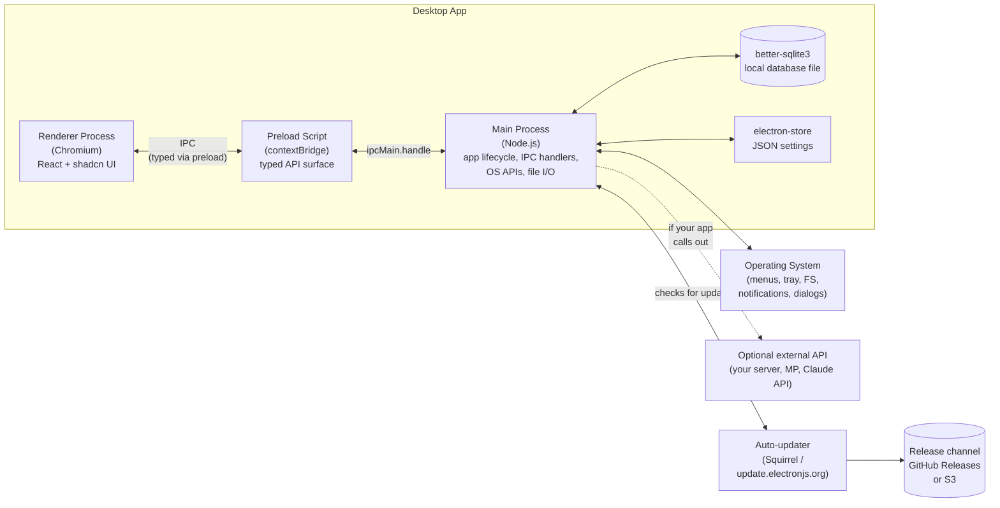

# Desktop — Electron + TypeScript

A standalone, cross-platform desktop application (Windows, macOS, Linux) built with Electron and TypeScript. **Standalone** is the key word — this starter assumes the desktop app is the whole product, with its own local data, its own packaging, and its own update channel. No backend assumed; if you do call out to a server, that's an integration the app makes, not a dependency it requires.

Pick this when a web app in a window isn't enough — you need OS integration (file system, native menus, tray, notifications, hardware), offline-first behavior, or distribution as an installer that IT can push.

---

## Stack at a glance

| Slot | Default | Alternatives |
|---|---|---|
| **Framework** | [Electron](https://www.electronjs.org) | Tauri (smaller binaries, Rust core), Neutralino |
| **Language** | TypeScript | — |
| **Scaffold / build pipeline** | [Electron Forge](https://www.electronforge.io) (Vite + TypeScript template) | electron-vite, electron-builder standalone |
| **UI library** | React | Vue, Svelte |
| **Component kit** | [shadcn/ui](https://ui.shadcn.com) | Park UI, HeroUI |
| **Styling** | Tailwind CSS | CSS Modules |
| **Local database** | [better-sqlite3](https://github.com/WiseLibs/better-sqlite3) (synchronous, embedded SQLite) | sql.js, LokiJS, RxDB |
| **Local key/value store** | [electron-store](https://github.com/sindresorhus/electron-store) | conf, custom JSON |
| **State management** | Zustand | Redux Toolkit, Jotai |
| **Auto-updater** | [Squirrel](https://github.com/Squirrel/Squirrel.Windows) (built into Forge) + [update.electronjs.org](https://update.electronjs.org) | electron-updater (S3, GitHub Releases, generic HTTP) |
| **Code signing** | Apple Developer ID (macOS), EV Certificate (Windows) | Self-signed (dev only) |
| **Distribution** | GitHub Releases (free), S3 bucket | Custom server, MSI/MSIX via Microsoft Store, .pkg / .dmg for macOS |
| **Crash / telemetry** | [Sentry](https://sentry.io) | Bugsnag, custom |

> **Tune this.** Electron Forge with the Vite + TypeScript template is the smoothest scaffold today. better-sqlite3 is the boring-good default for local data; if you need sync to a server, look at RxDB or build it explicitly into your IPC layer.

---

## Architecture diagram



**Three processes, one rule:** never expose Node APIs directly to the renderer. The renderer is sandboxed; the preload script defines a narrow, typed bridge; the main process holds the keys to the OS and the database.

---

## Component breakdown

### Main process (`src/main.ts`)
The Node.js process that runs when the app starts. Owns:
- App lifecycle (`app.whenReady`, `before-quit`, etc.)
- `BrowserWindow` creation
- IPC handlers (`ipcMain.handle('channel', fn)`)
- Native OS work: file dialogs, menus, tray, notifications
- The database connection (better-sqlite3 instance)
- The auto-updater

### Preload script (`src/preload.ts`)
Runs in a privileged context **before** the renderer loads. Its only job: use `contextBridge.exposeInMainWorld` to expose a small, typed API to the renderer. Renderer code calls `window.api.users.list()`; the preload forwards that to `ipcRenderer.invoke('users:list')`; the main process handles it.

This is the security boundary. Keep it narrow. Type it carefully.

### Renderer process (`src/renderer.tsx`)
A normal React app — same patterns as web (shadcn, Tailwind, Zustand for state). The only difference: instead of `fetch('/api/...')`, you call `window.api.something()`.

### Local data
- **better-sqlite3** for structured data (synchronous, fast, embedded). The DB file lives in `app.getPath('userData')`.
- **electron-store** for settings, preferences, last-opened-file lists — anything JSON-shaped.

### IPC layer (the contract between renderer and main)
Centralize this. A typical layout:
```
src/
  ipc/
    channels.ts      # union of all channel names + payload/return types
    handlers.ts      # ipcMain.handle wiring (called from main)
    api.ts           # the contextBridge.exposeInMainWorld surface (called from preload)
```
The renderer imports types from `channels.ts` only — never the handlers.

---

## Scaffold

```bash
# 1. Create the app (Vite + TypeScript template)
npx create-electron-app@latest my-app --template=vite-typescript
cd my-app

# 2. Add React + shadcn
npm install react react-dom
npm install -D @types/react @types/react-dom @vitejs/plugin-react

# Configure Vite for React (edit vite.renderer.config.ts), then:
npx shadcn@latest init
npx shadcn@latest add button card dialog

# 3. Local data
npm install better-sqlite3 electron-store
npm install -D @types/better-sqlite3

# 4. Run in dev (HMR for renderer, restart for main)
npm start

# 5. Package the app for the current OS
npm run make
```

**Native modules note:** `better-sqlite3` is a native module. Forge handles rebuilding it for Electron's Node version automatically, but if you add other native deps, you may need to run `electron-rebuild` or configure Forge's rebuild step.

**Forge config (`forge.config.ts`)** — uses the Vite plugin to bundle main, preload, and renderer separately. The default Vite + TypeScript template wires this up; just add a `renderer` entry per window if you have multiple.

---

## Deployment

Desktop deployment is a different beast from web. There's no "push to deploy" — there's **build, sign, distribute, update**.

### Code signing (do this before your first release)
- **macOS:** enroll in the Apple Developer Program ($99/yr). Get a Developer ID Application certificate. Sign with `electron-osx-sign` (Forge handles it via config). **Notarize** with `electron-notarize` — required for Gatekeeper to let users open the app.
- **Windows:** buy a code-signing certificate (EV recommended — instant SmartScreen reputation). Standard certs work but accumulate reputation slowly. Sign during the make step via Forge's `windowsSign` config.
- **Linux:** signing is less of a story; ship `.deb`, `.rpm`, or AppImage as you prefer.

> **Skipping signing in dev is fine; skipping it in production means SmartScreen warnings, Gatekeeper blocks, and a support headache.**

### Building installers
```bash
npm run make
```
Forge produces installers for the current platform: `.exe` (Squirrel) on Windows, `.dmg` and `.zip` on macOS, `.deb` / `.rpm` on Linux. Cross-compiling is possible but signing on the target OS is much easier — use GitHub Actions matrix builds (one runner per OS).

### Auto-updates
- Easiest: **[update.electronjs.org](https://update.electronjs.org)** — free, GitHub-Releases-backed, works for public OSS apps.
- Self-hosted: ship to S3 with **electron-updater** and write a tiny `latest.yml` per platform.
- Either way: bump `version` in `package.json`, run `npm run publish`, and Squirrel handles the rest on user machines.

### Distribution
- **GitHub Releases** (free, public) — simplest path; auto-updater can pull from here directly.
- **S3 bucket** behind your own domain — gives you private releases for internal-only tools.
- **Microsoft Store / Mac App Store** — adds review friction and sandboxing constraints; only worth it for consumer apps.

---

## CLAUDE.md template

Copy this file to the root of your scaffolded app.

````markdown
# Project — Electron Desktop App

## Stack
- **Framework:** Electron + TypeScript
- **Build pipeline:** Electron Forge with the Vite + TypeScript template
- **Renderer UI:** React, shadcn/ui in `src/components/ui/`, Tailwind CSS
- **State (renderer):** Zustand
- **Local storage:** better-sqlite3 (structured data) + electron-store (settings)
- **Distribution:** Squirrel installer, signed with [Apple Developer ID / Windows EV cert]
- **Updates:** [update.electronjs.org / electron-updater on S3]

## Use Context7 for current docs
Before writing non-trivial code in any of these areas, fetch latest docs via the Context7 MCP server.

Libraries to consult via Context7 when relevant:
- `electron` — `BrowserWindow`, `ipcMain` / `ipcRenderer`, `contextBridge`, `app` lifecycle, security advisories
- `electron-forge` — `forge.config.ts`, makers, publishers, the Vite plugin
- `vite` — config for renderer/main/preload
- `better-sqlite3` — prepared statements, transactions, migrations
- `shadcn/ui` and `tailwindcss` — current install/config syntax

When unsure, prefer a Context7 lookup over guessing — Electron security guidance changes between majors.

## The three-process model (read this first)

This app has three execution contexts. Treat them as separate worlds:

1. **Main process** (`src/main.ts`) — Node.js. Has access to the OS, file system, native modules, the database. Single instance. Owns app lifecycle.
2. **Preload script** (`src/preload.ts`) — runs before the renderer loads, in a privileged but isolated context. The ONLY place that uses `contextBridge.exposeInMainWorld`.
3. **Renderer process** (`src/renderer.tsx`) — Chromium sandbox. NO direct Node access. Talks to main only via the API exposed by preload.

**Security rules — never violate these:**
- `nodeIntegration: false`, `contextIsolation: true`, `sandbox: true` on every `BrowserWindow`.
- The renderer never imports anything from `electron`, `fs`, `path`, `better-sqlite3`, or any Node module.
- Every IPC handler in the main process validates its inputs before touching the database or filesystem.
- Don't load remote URLs into the main BrowserWindow. If you need a webview, use a sandboxed `<webview>` tag deliberately.

## IPC conventions

The IPC layer is the contract between renderer and main. Centralize it:

```
src/ipc/
  channels.ts   # all channel names + payload/return types (renderer-safe)
  handlers.ts   # ipcMain.handle wiring (main only)
  api.ts        # contextBridge.exposeInMainWorld surface (preload only)
```

- Renderer imports types from `channels.ts` only.
- New IPC channels: define type in `channels.ts`, wire handler in `handlers.ts`, expose in `api.ts`. All three or none.
- Channel names use `domain:action` (e.g., `users:list`, `files:open-dialog`).

## Data access
- All SQLite access goes through query functions in `src/db/queries/`. No ad-hoc SQL in IPC handlers.
- Migrations live in `src/db/migrations/` and run on app start (idempotent).
- The DB file path is `path.join(app.getPath('userData'), 'app.db')` — never hardcode.

## Files I'll always need to know about
- `src/main.ts` — main process entry
- `src/preload.ts` — the contextBridge surface
- `src/renderer.tsx` — React entry
- `src/ipc/` — the IPC contract
- `src/db/` — SQLite schema, migrations, queries
- `forge.config.ts` — packaging, signing, publishing

## When generating code
- Renderer code: write it like a normal React app, but call `window.api.*` instead of `fetch`.
- Need a new capability in the renderer? Add an IPC channel — don't try to import Node modules.
- Don't disable `contextIsolation` or enable `nodeIntegration` to "make something work." That's a security regression — find the IPC-shaped solution instead.
- Native modules (better-sqlite3, etc.) are fine but require Forge's rebuild step; flag any new native dep before adding it.
````
