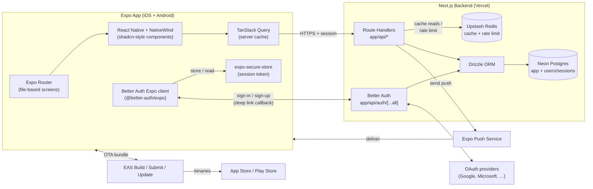

# Mobile — Expo + React Native + TypeScript

A cross-platform mobile app (iOS + Android) built with Expo, React Native, and TypeScript. **This starter assumes a paired Next.js backend** (the [web starter](web-nextjs.md)) provides data, auth callbacks, and any heavy lifting — the mobile app is a typed client over that backend's Route Handlers, with thin local persistence for offline UX.

Pick this when your users live on phones — visitor connect cards filled in during a service, volunteer check-in, prayer-request capture, push notifications for ministry events.

---

## Stack at a glance

| Slot | Default | Alternatives |
|---|---|---|
| **Framework** | [Expo](https://expo.dev) (managed workflow) | Bare React Native, Flutter |
| **Language** | TypeScript | — |
| **Routing** | [Expo Router](https://docs.expo.dev/router/introduction/) (file-based) | React Navigation directly |
| **Component / styling** | [NativeWind](https://www.nativewind.dev) (Tailwind for RN) | [Tamagui](https://tamagui.dev), React Native Paper, RN Reusables |
| **Data fetching** | [TanStack Query](https://tanstack.com/query) | SWR, RTK Query, plain fetch |
| **HTTP client** | `fetch` (built-in) | Axios, ky |
| **Schema validation** | Zod (shared with Next.js backend) | Valibot, Yup |
| **Auth client** | [Better Auth Expo](https://better-auth.com/docs/integrations/expo) (`@better-auth/expo`) — talks to the same Better Auth instance running on the Next.js backend | Cloud-hosted unified-login providers: [Clerk Expo](https://clerk.com/docs/quickstarts/expo), [Auth0 React Native](https://auth0.com/docs/quickstart/native/react-native). Pick when you have multiple apps and want one identity across all of them. |
| **Secure token storage** | [expo-secure-store](https://docs.expo.dev/versions/latest/sdk/securestore/) | `@react-native-async-storage` (non-sensitive only) |
| **Local cache / state** | TanStack Query cache + Zustand for UI state | MMKV for large structured cache |
| **Push notifications** | [Expo Notifications](https://docs.expo.dev/push-notifications/overview/) | OneSignal, Firebase Cloud Messaging directly |
| **Build / submit** | [EAS Build + EAS Submit](https://docs.expo.dev/eas/) | Bare RN with Fastlane |
| **OTA updates** | [EAS Update](https://docs.expo.dev/eas-update/introduction/) | CodePush (RN community fork) |
| **Crash / analytics** | [Sentry](https://sentry.io) for Expo | Bugsnag, Firebase Crashlytics |
| **Backend** | **Next.js Route Handlers** (the [web starter](web-nextjs.md)) | Standalone Hono/Fastify API, Supabase, Firebase |

> **Tune this.** The Expo defaults (Router, NativeWind, EAS) are the smoothest path. The big call to make early: **Expo managed** (this starter) vs **bare** — managed gets you OTA updates, EAS Build, easy upgrades; bare gets you arbitrary native modules. Stay managed unless a specific native need forces you out.

---

## Architecture diagram



**Data flow in one sentence:** the app's Better Auth Expo client signs in against the Next.js backend's Better Auth handler (with deep-link OAuth callbacks), persists the session in `expo-secure-store`, and TanStack Query calls Route Handlers with that session attached — same backend, same `users`/`sessions` tables, no separate identity provider.

---

## Component breakdown

### `app/` — Expo Router screens
File-based, mirrors the Next.js mental model. `app/(tabs)/index.tsx` is a tab. `app/_layout.tsx` is a layout. `app/[id].tsx` is a dynamic route. The default Expo template scaffolds a tab navigator.

### `components/` — shared UI
Use NativeWind (`className="flex-1 bg-background"`) and follow shadcn-like primitives. Several community ports of shadcn to RN exist (RN Reusables, etc.) if you want the same component vocabulary across web and mobile.

### `lib/api/` — typed backend client
The contract with your Next.js backend lives here. Centralize:
- `lib/api/client.ts` — base `fetch` wrapper that attaches the Better Auth session (the auth client wires this in automatically)
- `lib/api/queries/*.ts` — TanStack Query hooks (`useUser`, `useEvents`, etc.)
- `lib/api/schemas.ts` — Zod schemas, ideally **shared with the backend** as a workspace package

> Sharing Zod schemas between the Next.js backend and the Expo app is the highest-leverage move you'll make. Set them up as a pnpm/npm workspace early — `packages/shared` with schemas and types, consumed by both apps.

### `lib/auth-client.ts` — Better Auth Expo client
Created with `createAuthClient` plus the `expoClient` plugin. Configures:
- `baseURL` — the deployed Next.js backend (or your dev tunnel)
- `scheme` — your app's deep-link scheme (e.g. `myapp://`) so OAuth callbacks land back in the app
- `storage: SecureStore` — sessions persisted in the OS keychain via `expo-secure-store`

The same Better Auth server instance powering the web app powers the mobile app — **one identity, one user table, one set of OAuth provider credentials**. The mobile client is just a different shape of the same auth flow.

On the backend side, add the mobile app's deep-link scheme to Better Auth's `trustedOrigins` (e.g. `myapp://`, plus `exp://` patterns for Expo Go in dev).

### Local persistence
- **expo-secure-store** for the auth token (encrypted, OS-backed keychain).
- **TanStack Query's cache** for fetched data — persisted to disk via `@tanstack/query-async-storage-persister` if you want offline reads.
- **Zustand** for ephemeral UI state (theme, drawer open, form drafts).

### Push notifications
The flow: app registers for a push token via `expo-notifications`, sends it to your backend (which stores it on the user record), backend POSTs to Expo's push API when something happens. Expo handles the APNs/FCM dance.

---

## Scaffold

```bash
# 1. Create the app (default template — TypeScript + Expo Router + tabs)
npx create-expo-app@latest my-app
cd my-app

# 2. Install NativeWind + Tailwind
npm install nativewind
npm install -D tailwindcss
npx tailwindcss init

# 3. Data + state
npm install @tanstack/react-query zustand zod

# 4. Auth (Better Auth Expo client — talks to the Next.js backend's Better Auth handler)
npm install better-auth @better-auth/expo
npx expo install expo-secure-store expo-linking expo-web-browser

# 5. Push notifications
npx expo install expo-notifications expo-device

# 6. Run in development
npx expo start
# → press i for iOS simulator, a for Android emulator,
#   or scan the QR with Expo Go on your phone
```

**Environment variables** (`.env`):
```
EXPO_PUBLIC_API_URL=https://your-app.vercel.app
# No client-side auth keys needed — Better Auth runs on the backend.
# OAuth provider credentials stay on the Next.js side.
```

**Deep link scheme:** set `scheme: "myapp"` in `app.json` (or `app.config.ts`). Pass the same scheme to the `expoClient` plugin and add `myapp://` to the backend's `trustedOrigins`. In dev with Expo Go, Better Auth's docs also recommend trusting `exp://` patterns for your local IP range.

> Anything prefixed `EXPO_PUBLIC_` is bundled into the client. Never put secrets here — secrets stay on the Next.js backend. Sessions flow client → backend, never the reverse.

---

## Deployment

Mobile distribution is permission slips and signed binaries. Budget time for the first release.

### EAS Build — produce binaries in the cloud
```bash
npm install -g eas-cli
eas login
eas build:configure
eas build --platform ios       # or android, or all
```
EAS Build runs on Expo's infrastructure, handles credential management (Apple certs, Android keystores), and produces a `.ipa` / `.aab` you can submit. Free tier covers casual dev; production teams typically need a paid plan.

### EAS Submit — send to the stores
```bash
eas submit --platform ios
eas submit --platform android
```
Uploads the latest build to App Store Connect / Google Play Console. The first submission is manual (TestFlight setup, app metadata, screenshots) — subsequent ones automate.

### EAS Update — OTA JS updates
```bash
eas update --branch production --message "Fix login crash"
```
Push JavaScript-only changes to users without a store review. **Native module changes still require a new build.** Use update channels (`production`, `preview`, `staging`) to control rollout.

### Store accounts — get these going early
- **Apple Developer Program:** $99/yr. Allow ~24h for enrollment.
- **Google Play Console:** $25 one-time. Allow ~24h.
- **App Store first-submission review:** typically 1–3 days, sometimes longer.

> **Internal-only distribution:** if the app is for staff/volunteers and not the general public, consider TestFlight for iOS (up to 10,000 testers) and Internal Testing tracks for Android. No store review needed.

---

## CLAUDE.md template

Copy this file to the root of your scaffolded app.

````markdown
# Project — Expo Mobile App

## Stack
- **Framework:** Expo (managed) + React Native + TypeScript
- **Routing:** Expo Router (file-based, in `app/`)
- **Styling:** NativeWind (Tailwind for RN)
- **Data:** TanStack Query against a Next.js backend (Route Handlers)
- **State:** Zustand for UI; TanStack Query cache for server data
- **Auth:** Better Auth Expo client (`@better-auth/expo`) talking to the same Better Auth server that powers the Next.js backend. Session persisted in `expo-secure-store`. OAuth callbacks via the app's deep-link scheme.
- **Push:** expo-notifications via Expo Push Service
- **Build / submit / OTA:** EAS

## Use Context7 for current docs
Before writing non-trivial code involving any of these libraries, fetch latest docs via the Context7 MCP server. Expo, React Native, and EAS evolve fast across SDK versions.

Libraries to consult via Context7 when relevant:
- `expo` — current SDK features, deprecations, config plugin syntax
- `expo-router` — layouts, groups `(tabs)`, dynamic routes, navigation API
- `react-native` — components and APIs (changes between versions, especially Reanimated, FlashList, etc.)
- `nativewind` — current setup (tailwind config, babel plugin)
- `@tanstack/react-query` — query/mutation patterns, persistence
- `better-auth` and `@better-auth/expo` — `expoClient` plugin, deep-link scheme, `trustedOrigins`, social sign-in flows on native
- `expo-notifications` — registration, channels, foreground vs background

When unsure, prefer a Context7 lookup over guessing.

## Backend assumption
This app talks to a Next.js backend (separate repo or workspace) that exposes Route Handlers under `/api/*` and a Better Auth handler at `/api/auth/[...all]`. The backend owns the database (Drizzle + Neon), including the `user` / `session` / `account` / `verification` tables, and uses **Upstash Redis** for server-side caching and rate limiting. The mobile app:
- Never talks to a database directly.
- Never holds secrets — only the user's session and public config.
- Authenticates against the same Better Auth instance the web app uses — one identity, one user record across both apps.
- Benefits from the backend's Redis cache automatically — hot endpoints (MP data, Claude responses, lookup tables) are served from Redis with a TTL, which is especially valuable when mobile users are on flaky cellular networks.

There are **two layers of cache** in this architecture, and they don't replace each other:
- **Backend Redis cache** (Upstash) — shared across all clients and regions, survives redeploys, fronts expensive third-party / DB reads.
- **Device cache** (TanStack Query) — per-user UI cache for stale-while-revalidate, retry on reconnect, optimistic updates, optional offline reads.

If you find yourself wanting to "just put the data in the app," stop — add (or cache) an endpoint on the backend instead.

## Conventions

### Routing (Expo Router)
- Screens live in `app/`. `(tabs)` for tab groups, `_layout.tsx` for shared chrome, `[id].tsx` for dynamic routes.
- Use `<Link href="...">` and the `router` API from `expo-router` — don't import from `@react-navigation/*` directly.

### Data fetching
- Every backend call goes through `lib/api/client.ts`, which is wired to the Better Auth Expo client so the session attaches automatically.
- Wrap calls in TanStack Query hooks in `lib/api/queries/*.ts`. Components consume `useFoo()`, never raw `fetch`.
- Validate response payloads with Zod schemas from `lib/api/schemas.ts` (shared with the backend if possible).
- **Two cache layers, distinct roles.** TanStack Query is the **on-device cache** — it handles UI freshness, retries, offline reads. **Upstash Redis on the backend** is the cross-request server cache for expensive reads. If a response feels slow, the fix usually belongs on the backend (add a Redis-backed `cached()` wrapper on the Route Handler) — not in client-side gymnastics.

### Auth (Better Auth Expo)
- The auth client lives in `lib/auth-client.ts` and is configured once with `expoClient({ scheme, storagePrefix, storage: SecureStore })`.
- Sign-in flows: call `authClient.signIn.email(...)` or `authClient.signIn.social({ provider: 'google', callbackURL: '/dashboard' })`. For social sign-in on native, navigate the user after the call resolves (the plugin handles the deep-link callback).
- Read the current user via `authClient.useSession()` (hook) or `authClient.getSession()` (imperative).
- The session is persisted in `expo-secure-store` automatically — don't roll your own token storage.
- New OAuth providers, password rules, or session config are server-side concerns — change them in the Next.js backend's `lib/auth.ts`, not here.

### Secure storage
- Better Auth manages session persistence via `expo-secure-store` — don't double up.
- Anything user-typed and sensitive (PII drafts, etc.) — `expo-secure-store`.
- Non-sensitive UI prefs (theme, recently-viewed) — `AsyncStorage` or MMKV is fine.

### Styling
- NativeWind: use `className` with Tailwind classes. Avoid `StyleSheet.create` unless you need a perf-critical or animated style.
- Theme tokens live in `tailwind.config.js`. Match the Next.js web app's tokens if you have one.

### Push notifications
- Token registration happens once on first launch; push to backend.
- Don't request notification permission until you've shown the user *why*.

## Files I'll always need to know about
- `app/` — screens and layouts
- `lib/api/` — backend client, query hooks, shared schemas
- `lib/auth-client.ts` — Better Auth Expo client (the only place auth config touches the app)
- `app.json` / `app.config.ts` — Expo config (deep-link scheme, permissions, plugins, EAS settings)
- `eas.json` — build profiles

## When generating code
- Default to the managed Expo workflow. If you think we need a custom native module, flag it before adding it (it forces us out of managed and breaks OTA for native changes).
- Don't introduce new state libraries. We have TanStack Query for server state, Zustand for UI state — that's enough.
- Don't bypass the API client. All backend calls go through `lib/api/client.ts`.
- Use `EXPO_PUBLIC_*` only for non-secret config. Secrets stay on the backend.
- For new screens, follow Expo Router file-based conventions; don't reach for `createStackNavigator` directly.
````
