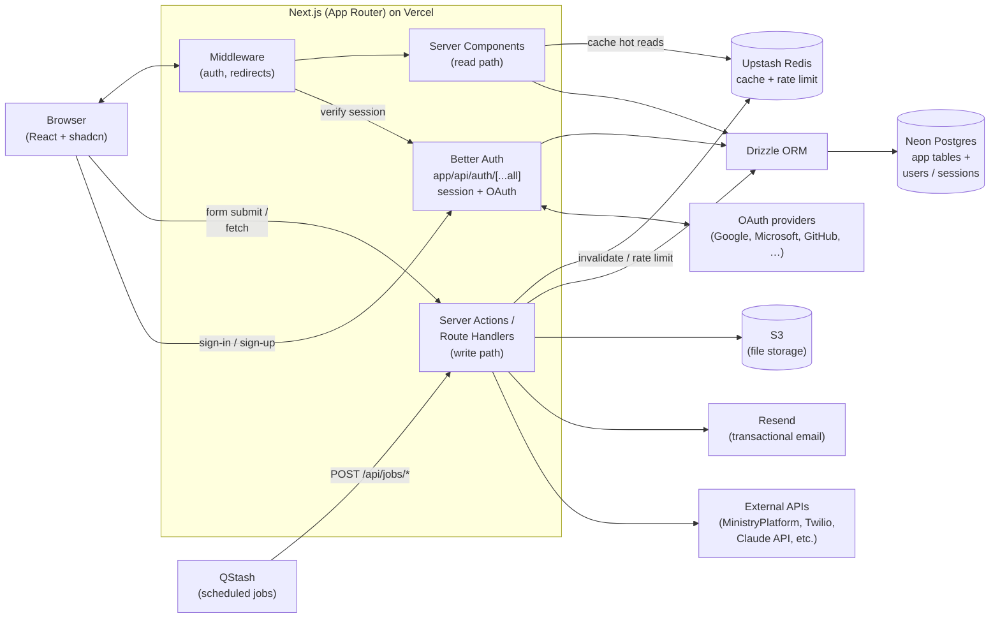

# Web — Next.js + Drizzle + Neon + shadcn

A full-stack web application built on Next.js (App Router), with Drizzle ORM talking to Neon Postgres, React Server Components and Server Actions for data flow, and shadcn/ui for the interface. This is the default starter for almost any web project: internal tools, member portals, dashboards, CRUD apps over your church's data, AI-augmented workflows.

---

## Stack at a glance

| Slot | Default | Alternatives |
|---|---|---|
| **Framework** | Next.js 16 (App Router, Turbopack) | Remix, SvelteKit, Astro |
| **Language** | TypeScript | — |
| **UI library** | React (Server Components first) | — |
| **Component kit** | [shadcn/ui](https://ui.shadcn.com) | Park UI, HeroUI, Mantine |
| **Styling** | Tailwind CSS | CSS Modules, Vanilla Extract |
| **ORM** | [Drizzle](https://orm.drizzle.team) | Prisma, Kysely |
| **Database** | [Neon Postgres](https://neon.tech) | Supabase Postgres, Vercel Postgres, AWS RDS |
| **Auth** | [Better Auth](https://better-auth.com) — self-hosted, owns your `users` / `sessions` tables in Neon via Drizzle | Cloud-hosted unified-login providers: [Auth0](https://auth0.com), [Clerk](https://clerk.com), [WorkOS AuthKit](https://workos.com/authkit). Pick one of these when you have multiple apps and want a single identity for users across all of them. NextAuth/Auth.js if you're already on it. |
| **File storage** | Vercel Blob | AWS S3, Azure Blob, Cloudflare R2, Supabase Storage |
| **Email** | [Resend](https://resend.com) | SendGrid, Postmark |
| **SMS / voice** | [Twilio](https://www.twilio.com) | MessageBird, Vonage |
| **Realtime** | [Pusher](https://pusher.com) | Ably, Supabase Realtime |
| **Background jobs** | [Upstash QStash](https://upstash.com/qstash) | Inngest, Trigger.dev, Vercel Cron |
| **Cache / KV** | [Upstash Redis](https://upstash.com/redis) | Vercel KV, Cloudflare KV |
| **Hosting** | [Vercel](https://vercel.com) | Netlify, AWS Amplify, Railway, self-host on Fly.io, Cloudflare |

> **Tune this.** Everything in the **Default** column is a "ship fast" pick that plays well with the rest of the stack. Swap freely — Drizzle works against any Postgres, shadcn works in any React app, and Better Auth is straightforward to swap out for Auth0/Clerk/WorkOS later if you outgrow self-hosted auth or want unified login across multiple apps.

---

## Architecture diagram



**Data flow in one sentence:** the browser hits a Server Component which renders HTML using data fetched through Drizzle from Neon; mutations go through Server Actions or Route Handlers, which write to the database and call `revalidatePath`/`refresh` so the next render is fresh.

---

## Component breakdown

### `app/` — the App Router
File-based routing. Every folder with a `page.tsx` is a route. Layouts (`layout.tsx`) wrap nested routes. Loading and error UI live next to the routes they serve (`loading.tsx`, `error.tsx`).

### Server Components (default) vs Client Components (`"use client"`)
- **Server Components** are the default. They run on the server, can be `async`, can talk directly to the database, and don't ship JavaScript to the browser. Use them for everything that doesn't need browser-only state or events.
- **Client Components** opt in with `"use client"` at the top of the file. Use them for interactivity (forms with local state, charts, anything using `useState` / `useEffect` / browser APIs).

Default rule of thumb: write a Server Component first, push interactivity into small Client Component leaves.

### Server Actions — the write path
Functions marked with `"use server"` that the client can call directly. They run on the server, validate input, write to the database, and return data. They replace most of what you'd traditionally put in `/api/*` routes.

### Route Handlers (`app/api/*/route.ts`) — for non-form callers
Use these when something other than your own UI needs to call you: webhooks (Stripe, Twilio, MP), QStash callbacks, mobile clients (the Expo starter calls these), third-party integrations.

### `db/` — the data layer
- `db/schema.ts` — Drizzle table definitions (the source of truth). Includes Better Auth's `user`, `session`, `account`, and `verification` tables alongside your application tables.
- `db/index.ts` — the `db` client, instantiated once with the Neon driver.
- `db/queries/*.ts` — reusable query functions, called from Server Components and Server Actions.

Drizzle migrations live in `drizzle/` and are generated with `drizzle-kit generate` and applied with `drizzle-kit migrate` (or run from a deploy hook).

### `lib/cache.ts` — Upstash Redis cache + rate limiter
Server-side cache for hot reads that don't need to hit Postgres on every request: third-party API responses (MinistryPlatform, Claude), expensive aggregations, lookup tables, feature flags. The `@upstash/redis` client is HTTP-based and runs in every Next.js runtime (Node, edge, workers), and the cache survives redeploys — both wins over Next.js's built-in `unstable_cache`.

Pair with `@upstash/ratelimit` to throttle public Route Handlers (mobile clients, webhooks, AI endpoints) per-user or per-IP.

**Default pattern:** wrap an expensive query function with a tiny `cached()` helper in `lib/cache.ts` that reads from Redis first, falls through to Drizzle on miss, and writes back with a TTL. Keep cache keys explicit and namespaced (`user:123:profile`, `mp:groups:list:v2`). Bust the cache from Server Actions after writes, or rely on TTL for read-mostly data.

> Use Redis when the data is shared across requests / regions and re-computing is expensive. For per-request memoization within a single render, React's built-in `cache()` is enough. For per-user UI state, use TanStack Query in the browser — don't push it through Redis.

### `lib/auth.ts` — Better Auth server instance
The single source of truth for auth config. Configures the Drizzle adapter, OAuth providers, session options, and any plugins. Imported wherever you need to read or mutate auth state.

The HTTP surface is mounted at `app/api/auth/[...all]/route.ts` via Better Auth's `toNextJsHandler` — that one file handles every sign-in/up/out, OAuth callback, and session check.

> **Why self-hosted auth as the default?** Your users and your application data live in the same database, in the same transaction. You can join `users` to your domain tables in Drizzle, customize the schema freely, and there's no third-party SaaS bill that scales with MAU. The trade is that you own the security surface — keep Better Auth updated and use OAuth providers for password-free sign-in where you can. **If you have multiple apps and want one identity across all of them**, swap to Auth0 / Clerk / WorkOS — that's what they're great at.

### `components/ui/` — shadcn primitives
shadcn/ui isn't a library — you copy components into your repo and own them. They live in `components/ui/`, styled with Tailwind, built on Radix primitives. Customize freely.

### `lib/` — shared utilities
Auth helpers, third-party clients (Resend, S3, Twilio), validation schemas (Zod), date/string formatters.

---

## Scaffold

```bash
# 1. Create the app
npx create-next-app@latest my-app
cd my-app

# 2. Install database + ORM
npm install drizzle-orm @neondatabase/serverless
npm install -D drizzle-kit

# 3. Install shadcn/ui
npx shadcn@latest init
npx shadcn@latest add button card form input dialog

# 4. Install auth (Better Auth default — self-hosted, owns your users/sessions tables)
npm install better-auth
# Generate Better Auth's Drizzle schema and merge it into db/schema.ts,
# then run drizzle-kit generate + migrate to create the tables in Neon.
npx @better-auth/cli generate

# 5. Server-side cache + rate limiting (Upstash Redis)
npm install @upstash/redis @upstash/ratelimit

# 6. Run the dev server
npm run dev
```

**Environment variables** (`.env.local`):
```
DATABASE_URL=postgres://...               # from Neon dashboard
BETTER_AUTH_SECRET=...                    # openssl rand -base64 32
BETTER_AUTH_URL=http://localhost:3000     # set to your deployed URL in production
# OAuth providers — add the ones you want:
GOOGLE_CLIENT_ID=...
GOOGLE_CLIENT_SECRET=...
MICROSOFT_CLIENT_ID=...
MICROSOFT_CLIENT_SECRET=...
RESEND_API_KEY=re_...
AWS_ACCESS_KEY_ID=...
AWS_SECRET_ACCESS_KEY=...
S3_BUCKET=...
UPSTASH_REDIS_REST_URL=...
UPSTASH_REDIS_REST_TOKEN=...
```

**Drizzle config** (`drizzle.config.ts`):
```ts
import { defineConfig } from 'drizzle-kit';

export default defineConfig({
  schema: './db/schema.ts',
  out: './drizzle',
  dialect: 'postgresql',
  dbCredentials: { url: process.env.DATABASE_URL! },
});
```

---

## Deployment

**Vercel (default):**
1. Push the repo to GitHub.
2. Import it at [vercel.com/new](https://vercel.com/new).
3. Add the same environment variables you have in `.env.local` to the Vercel project's **Environment Variables** screen.
4. Push to `main` to deploy production; every PR gets a free preview URL with its own isolated Neon branch (if you connect the Neon integration).

**Database migrations on deploy:** add `"postbuild": "drizzle-kit migrate"` to `package.json`, or run migrations from a separate CI step before promotion. Don't run them as a Vercel build step if your build runs in parallel across regions — pick a single migration runner.

**Custom domain:** add it in Vercel → Settings → Domains. Update `BETTER_AUTH_URL` and add the production URL to Better Auth's `trustedOrigins` (and to each OAuth provider's authorized redirect URIs — Google Cloud Console, Microsoft Entra app registration, etc.).

---

## CLAUDE.md template

Copy this file to the root of your scaffolded app. It's the first thing Claude Code reads when you open the project, and it pre-loads the architectural context so Claude doesn't have to guess.

````markdown
# Project — Next.js Web App

## Stack
- **Framework:** Next.js 16 (App Router, Turbopack, TypeScript)
- **UI:** React Server Components by default; `"use client"` only for interactive leaves
- **Components:** shadcn/ui in `components/ui/` — these are owned by us, edit freely
- **Styling:** Tailwind CSS
- **ORM:** Drizzle (`db/schema.ts` is the source of truth — includes Better Auth's user/session/account/verification tables)
- **Database:** Neon Postgres
- **Auth:** Better Auth (self-hosted, mounted at `app/api/auth/[...all]/route.ts`, server config in `lib/auth.ts`)
- **Server-side cache / rate limit:** Upstash Redis via `@upstash/redis` and `@upstash/ratelimit`, helpers in `lib/cache.ts`
- **Hosting:** Vercel

## Use Context7 for current docs
Before writing non-trivial code involving any of these libraries, fetch the latest docs via the Context7 MCP server. Our training data may be stale; Context7 isn't.

Libraries to consult via Context7 when relevant:
- `next.js` — App Router, Server Components, Server Actions, caching/`revalidatePath`/`refresh`, middleware
- `drizzle-orm` — schema, queries, relations, migrations
- `@neondatabase/serverless` — driver setup, edge vs node runtime
- `better-auth` — server config (`betterAuth({...})`), Drizzle adapter, `toNextJsHandler`, `auth.api.getSession`, OAuth providers, plugins, `trustedOrigins`
- `@upstash/redis` — client setup, common commands, JSON helpers, edge runtime usage
- `@upstash/ratelimit` — sliding-window / token-bucket setup, identifying callers, multi-zone fallbacks
- `shadcn/ui` — component installation and theming
- `tailwindcss` — current config syntax (it changes between major versions)

When unsure, prefer a Context7 lookup over guessing.

## Conventions

### Server vs client components
- Default to Server Components. They can be `async` and call `db` directly.
- Add `"use client"` ONLY when you need `useState`, `useEffect`, event handlers, or browser APIs.
- Keep client components small. Push them to the leaves of the tree.

### Data access
- All database access goes through Drizzle — no raw SQL strings except in migrations.
- Reusable queries live in `db/queries/*.ts`. Components import named query functions; they don't compose Drizzle queries inline unless trivial.
- Mutations happen in **Server Actions** (`"use server"`) or **Route Handlers**. Never expose the database client to the browser.
- After a mutation, call `revalidatePath` / `revalidateTag` (or `refresh()` from `next/cache`) so the read path picks up the change.

### Auth
- Better Auth server instance lives in `lib/auth.ts`. Treat it as the single source of truth — all OAuth providers, session config, and plugins are configured there.
- The HTTP surface is mounted at `app/api/auth/[...all]/route.ts` via `toNextJsHandler(auth)`. Don't hand-roll auth routes alongside it.
- In Server Components and Server Actions, get the current session with:
  ```ts
  import { auth } from "@/lib/auth";
  import { headers } from "next/headers";
  const session = await auth.api.getSession({ headers: await headers() });
  ```
- Protect routes via `middleware.ts` that checks the session (or via per-page guards that `redirect()` when `session` is null). Never trust user-supplied IDs — derive `userId` from the session.
- Better Auth tables (`user`, `session`, `account`, `verification`) live in `db/schema.ts` alongside app tables. Generate them with `npx @better-auth/cli generate` when config changes.
- Schema or session config changes always need a Drizzle migration: `drizzle-kit generate` then `drizzle-kit migrate`.

### Caching and rate limiting (Upstash Redis)
- Use the `cached()` helper in `lib/cache.ts` to wrap expensive read functions — third-party API calls, heavy aggregations, anything stable enough to TTL.
- Cache keys are explicit and namespaced (`mp:groups:list:v2`, `user:{id}:profile`). Bump the version suffix when the shape changes.
- Bust cache entries from Server Actions after writes (`del(...)`); for read-mostly data, rely on TTL.
- For public Route Handlers (mobile clients, webhooks, AI endpoints), wrap with `@upstash/ratelimit` keyed by user ID or IP.
- **Don't** push UI state or per-request memoization through Redis. Use React's `cache()` for per-request, TanStack Query in the browser for client UI state, and Redis only for cross-request shared data.

### Forms and validation
- Validate input with Zod at the edge of every Server Action / Route Handler.
- Use shadcn's `Form` + `react-hook-form` + Zod resolver for client-side UX.

### Files I'll always need to know about
- `db/schema.ts` — the data model
- `db/queries/` — reusable query functions
- `app/` — routes, layouts, Server Actions
- `lib/auth.ts` — Better Auth server config
- `lib/cache.ts` — Upstash Redis client, `cached()` helper, rate-limiter instances
- `lib/` — third-party clients and shared helpers
- `components/ui/` — shadcn primitives (owned, customized)

## When generating code
- Prefer Server Components and Server Actions over Route Handlers + `fetch`.
- Don't introduce new third-party libraries without flagging the choice — we have defaults for auth, email, storage, realtime, jobs.
- Write narrow, named query functions in `db/queries/`. Don't sprinkle Drizzle calls across components.
- For UI, prefer adding shadcn components (`npx shadcn@latest add ...`) over hand-rolling Radix wrappers.
````
