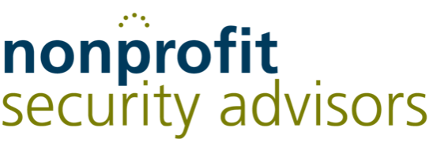

# AI Context Engineering Workshop

### Workshop Schedule — Peoria, IL — May 7-8, 2026

---

### 📱 CITN Conference App

> **All conference details and information live in the [CITN Conference app](https://app.churchitnetwork.com/app/).** All attendees will need it to **check in on Thursday morning (May 7)**, so download and sign in before you arrive.

> ⚠️ **The most current schedule is now available ONLY in the CITN Conference app.** This page may be out of date — always check the app for the latest times, sessions, and any last-minute changes.

## At a Glance

| | Day 0 — Meet & Greet (May 6) | Day 1 — Foundations (May 7) | Day 2 — Build Day (May 8) |
|---|---|---|---|
| **Theme** | Meet the crew; finish prerequisites | Learn the mindset, the workflow, and how to build context | Apply it end-to-end: plan, build, and ship a Next.js app |
| **Format** | Casual meet-and-greet + AI Genius Bar | Concepts + short hands-on exercises | Guided build with checkpoints |

Both days run **9:00 AM – 5:00 PM** with a **75-minute lunch**, a **15-minute morning break**, and a **20-minute afternoon break (snacks provided).** **Day 1 opens with coffee and doughnuts at 8:30 AM** for a relaxed arrival before the 9:00 hot start.

> **Sponsor speaking times are baked into breaks and meals:** snack sponsors get **2–3 minutes** at each snack break, and meal sponsors get **3–5 minutes** at lunch and dinner.

---

## Day 0 — Meet & Greet (May 6)

A relaxed evening to meet the crew and wrap up any prerequisite setup before Day 1. Attendance is optional but encouraged — especially if you haven't finished setup.

| Time | Duration | Session |
|---|---|---|
| TBD | — | 👋 **Meet & Greet** — casual mingling, food/drinks, name tags |
| (same window) | — | 🧰 **AI Genius Bar** — *Tripp & Patrick* on hand to help anyone still finishing the [prerequisites](../_requirements/README.md) |

---

## Day 1 — Foundations (May 7)

| Time | Duration | Session |
|---|---|---|
| 8:30 – 8:45 | 15 min | ☕ Coffee & doughnuts — relaxed arrival |
| 8:45 – 9:00 | 15 min | Find your seat, get settled |
| 9:00 – 9:30 | 30 min | **Welcome & Kickoff** *(Jason)* — welcome, prayer, short demo, logistics (bathrooms, break schedule, baseball), goals for the two days, setup check against the [prerequisites guide](../_requirements/README.md) |
| 9:30 – 10:15 | 45 min | **Vibe Coding vs. Context Engineering** — what the difference is, why it matters, what "good" looks like |
| 10:15 – 10:30 | 15 min | ☕ Morning break *(snack sponsor: 2–3 min)* |
| 10:30 – 11:30 | 60 min | **SDLC Crash Course** — git, VS Code, terminal, repos, commits, branches. Light but enough to participate confidently the rest of the workshop |
| 11:30 – 12:30 | 60 min | **Building the Context for Context Engineering — Part 1** — `CLAUDE.md`, requirements docs, conventions, how to write for an LLM audience |
| 12:30 – 1:45 | 75 min | 🍽 **Lunch** — 20 min downtime, then **2 partner spots** *(2–5 min each)*, then **Inspirational Show & Tell** — *Northwoods, Matt, JP, Manch* share past builds to spark ideas for Day 2 |
| 1:45 – 2:45 | 60 min | **Building the Context for Context Engineering — Part 2** — hands-on: authoring context for a sample project, critique, iterate |
| 2:45 – 3:30 | 45 min | **Claude Code for the Non-Developer** — Trace |
| 3:30 – 3:50 | 20 min | 🍎 Afternoon break + snacks *(snack sponsor: 2–3 min)* |
| 3:50 – 4:20 | 30 min | **PRTDUD Workflow — Overview** — the core loop: **P**lan · **R**eview · **T**est · **D**ebug · **U**pdate · **D**eploy. When to use each phase and what it produces. Full hands-on practice happens on Day 2 |
| 4:20 – 5:00 | 40 min | **Inspire Leaders to Innovation Panel** — audience-wide closing session |
| 6:30 PM | — | 🍴 Dinner *(meal sponsor: 3–5 min)* |

---

## Day 2 — Build Day (May 8)

> **Facilitator cadence during Build Blocks:** every 10–15 minutes, facilitators will do a quick *"you should be about here in your build"* checkpoint callout so the room stays in sync.

| Time | Duration | Session |
|---|---|---|
| 9:00 – 10:00 | 60 min | **Day 2 Kickoff & Choosing Your Medium** — pick your project, framing for the build, what "done" looks like by 5 PM; plus a comparison of mediums (web, mobile, desktop, service, agents) and tradeoffs to inform today's choice |
| 10:00 – 10:30 | 30 min | **Next.js with Claude Code** — scaffolding, establishing project-level context, the first few prompts |
| 10:30 – 10:45 | 15 min | ☕ Morning break *(snack sponsor: 2–3 min)* |
| 10:45 – 12:30 | 105 min | **Build Block 1 — Plan & Review** — requirements, architecture, data model, review before writing code |
| 12:30 – 1:45 | 75 min | 🍽 Lunch *(meal sponsor: 3–5 min)* |
| 1:45 – 3:15 | 90 min | **Build Block 2 — Execute & Test** — implement features, iterate, validate against the plan |
| 3:15 – 3:35 | 20 min | 🍎 Afternoon break + snacks *(snack sponsor: 2–3 min)* |
| 3:35 – 4:30 | 55 min | **Deploying to Vercel** — from local to live, environment config, common gotchas |
| 4:30 – 5:00 | 30 min | **Show & Tell / Closing** — share what you built, Q&A, where to go next |
| 6:30 PM | — | 🍴 Dinner *(meal sponsor: 3–5 min)* |

---

<strong>Made possible by our partners</strong>

  
  &nbsp;&nbsp;&nbsp;&nbsp;
  
  &nbsp;&nbsp;&nbsp;&nbsp;
  
  &nbsp;&nbsp;&nbsp;&nbsp;
  
  &nbsp;&nbsp;&nbsp;&nbsp;
  
  &nbsp;&nbsp;&nbsp;&nbsp;
  
  &nbsp;&nbsp;&nbsp;&nbsp;
  
  &nbsp;&nbsp;&nbsp;&nbsp;
  
  &nbsp;&nbsp;&nbsp;&nbsp;
  
  &nbsp;&nbsp;&nbsp;&nbsp;
  
  &nbsp;&nbsp;&nbsp;&nbsp;
  
  &nbsp;&nbsp;&nbsp;&nbsp;
  
  &nbsp;&nbsp;&nbsp;&nbsp;
  

